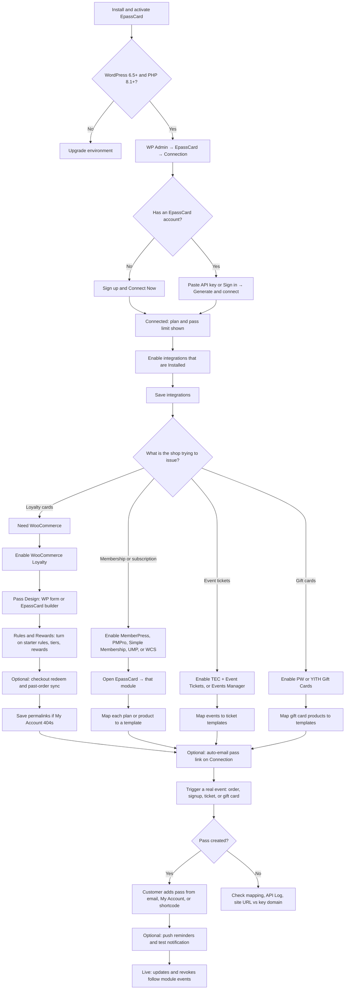

# User onboarding flow

Plan for guiding a customer from plugin install to their first working Apple Wallet / Google Wallet pass. No wizard exists in the plugin today; this is the intended path through current screens.

**Landing page after activate:** WordPress Admin → **EpassCard → Connection**

## Process

## Recommended first-run path

Do this in order. Skip branches that do not match the store.

### 0. Before WordPress

- WordPress 6.5+, PHP 8.1+.
- At least one companion plugin: **WooCommerce** (loyalty), or a membership / subscriptions / events / gift-card plugin from the integrations table.
- Site URL in **Settings → General** must match how the API key will be registered (`http` vs `https`). A mismatch later fails API calls.

### 1. Activate the plugin

- Install and activate **EpassCard**.
- Open **EpassCard → Connection** (default landing page).
- Optional: 30-day **Get free setup help** WhatsApp card in the admin sidebar.

### 2. Connect the SaaS account

Pick one:

1. **Sign up & Connect Now** — name + email; password is emailed; site stores a new API key.
2. **Sign in** — existing email/password → **Generate & connect**.
3. **Use API key** — copy from [app.epasscard.com/api-keys](https://app.epasscard.com/api-keys) → **Connect**.

Success looks like: Connected, account email, plan name, pass quota, optional key expiry.

### 3. Enable only what is installed

On the same page, **Integrations** lists modules. Checkboxes are disabled until the required plugin is active.

| Goal | Enable | Required plugin |
|---|---|---|
| Points + loyalty StoreCard | WooCommerce Loyalty | WooCommerce |
| Membership card | MemberPress, PMPro, Simple Membership, or UMP | That membership plugin |
| Subscription card | WooCommerce Subscriptions | WooCommerce Subscriptions |
| Event ticket | The Events Calendar or Events Manager | TEC **plus Event Tickets**, or Events Manager |
| Gift card pass | PW Gift Cards or YITH Gift Cards | That gift-card plugin |

Click **Save integrations**. Enabled modules appear under **EpassCard**.

### 4a. Loyalty path (WooCommerce stores)

This is the most complete in-plugin setup. Starter earning rules, tiers, and rewards are seeded **inactive**.

1. **EpassCard → WooCommerce Loyalty → Pass Design**  
   Design in WordPress (API v2 StoreCard) **or** pick a template from the EpassCard builder. Connection is required before save.
2. **Rules & Rewards** tabs, in this order:  
   **Basics** (which order statuses earn points) → **Earning** (turn on “1 point per $1”, welcome bonus, etc.) → **Tiers** → **Rewards** → optional **Checkout redeem** → optional **Past orders** for existing customers → **Notifications**.
3. If `/my-account/loyalty-wallet/` 404s, save **Settings → Permalinks** once.
4. Place a test order as a logged-in customer. Confirm points on **Customers**, pass on **Issued passes**, and the card on **My Account → Loyalty wallet**.

### 4b. Membership / events / gift cards path

Templates are designed in the EpassCard app first (unless loyalty form design is used).

1. Open **EpassCard → [module]**.
2. For each plan, product, event, or gift-card product: **Set up mapping** → choose template → map name, email, expiry, barcode, etc. → save.
3. Optional: **Pass link email** on Connection (auto-email on create, WooCommerce order emails).
4. Trigger the real event (signup, approved booking, issued gift card) **or** use **Create pass** on the issued-passes / members list.

### 5. How the customer receives the pass

- Email link (auto or **Email pass link**).
- WooCommerce **My Account → Wallet passes** (and **Loyalty wallet** if loyalty is on).
- MemberPress account **Wallet Passes**.
- Shortcode `[epc_my_passes]` on any page.

They open the link and add to **Apple Wallet** or **Google Wallet**.

### 6. After the first pass (keep it running)

- Profile / status / balance changes update or revoke the pass per module rules.
- Configure **Push notification copy** on the module page; send a **test notification**.
- Use **EpassCard → API Log** when create/update fails.

## Success checklist

The in-plugin **Setup Wizard** (`EpassCard → Setup Wizard`) walks a new merchant through this path and can issue a test loyalty pass at the end. Existing connected sites are not forced into the wizard.

A customer is onboarded when all of these are true:

- Connection shows Connected.
- At least one available integration is enabled.
- A template exists (loyalty designer **or** mapped EpassCard template).
- For loyalty: at least one earning rule is **Active**.
- One real record produced a pass with a `pass_link`.
- The shopper can add the pass from email or My Account.

## Related guides

- [Getting started](getting-started.md)
- [Connection](connection.md)
- [Integrations](integrations.md)
- [Template mapping](mapping.md)
- [Passes & email](passes-and-email.md)
- [My Account & shortcode](my-account.md)
- [Push notifications](notifications.md)
- [API log](api-log.md)

## Product gaps (later)

The current product assumes the merchant already knows this sequence. A later implementation could add a first-run wizard on Connection: choose use case → connect → enable matching module → design/map → create a test pass.

`getting-started.md` still describes membership first and barely mentions WooCommerce Loyalty, which is now a first-class path.

The smallest useful ship for a wizard is a Connection checklist that marks **Connect → Enable → Map/Design → First pass**, with a branch for loyalty vs other modules.
